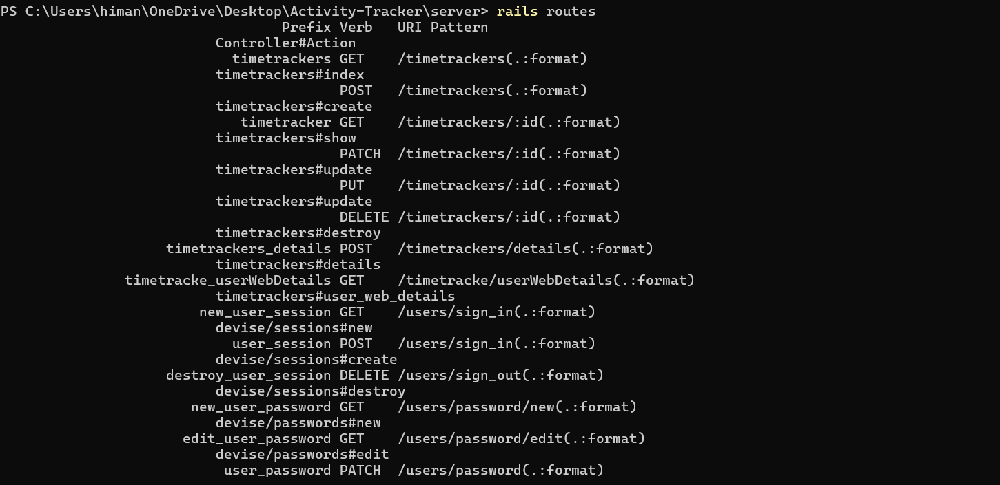
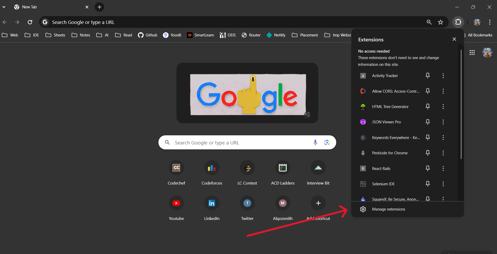
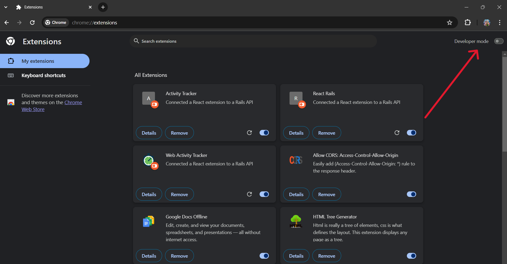
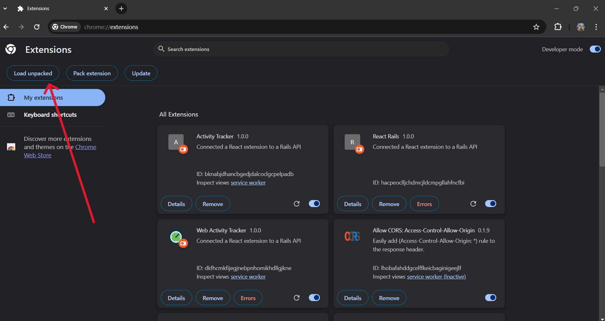

# Activity Tracker Chrome Extension and Personalized Dashboard

Welcome to the Activity Tracker project! This repository contains the code for a Chrome extension and a personalized dashboard aimed at tracking and analyzing internet usage to promote productivity. With features like `website tracking, productivity browsing, and personalized analytics`, this project aims to help users manage their online time effectively.

---

## Live Video Demo

- just go to `client/extension`
- do `npm run build` , you will get the build folder uploaded in video

- [Live Demo](https://drive.google.com/file/d/1PAPFaDxewECm-WyQqFg2tOjFhr-9FfZd/view?usp=sharing)

---

## Directory Structure

The project is organized into two main folders:

- **client**: Contains the client-side code for the Chrome extension and the Personalized Dashboard.
  - **extension**: Code for the Chrome extension.
  - **Personalized_dashboard**: Code for the personalized dashboard.

- **server**: Contains the server-side code for the Ruby on Rails API server.
  - This folder includes authentication using the [devise-api gem](https://github.com/nejdetkadir/devise-api).

---

## Tech Stack

- **Backend Framework**: Ruby on Rails
- **Frontend Framework**: React
- **Database**: SQLite

---

## Setup Instructions for setupping at Local

### Backend (Server)

1. Install dependencies using `bundle install`.
2. Migrate the database using `rails db:migrate`.
3. Start the Rails API server using `rails server`.
4. View available routes using `rails routes`.

[Backend deployed link](https://activity-tracker-server.onrender.com)

### Frontend (Client)

#### Chrome Extension

1. Navigate to the `extension` folder.
2. Install dependencies using `npm install`.
3. Build the extension using `npm run build`.
4. Open Chrome and go to the extensions management section. Enable developer mode.
5. Load the extension by selecting "Load unpacked". This will ask for a folder to upload. Choose the `build` folder created in the extension directory after `npm build`.

**Guides -**

;

#### Personalized Dashboard

1. Navigate to the `Personalized_dashboard` folder.
2. Install dependencies using `npm install`.
3. Start the development server using `npm start`.

[Dashboard deployed link](https://main--activitytrackerpersonalizeddashboard.netlify.app/) 

---

# Database Schema

The database schema for the Activity Tracker project is as follows:

## users

- Stores user data.

| Column Name           | Data Type | Nullable | Description                                     |
|-----------------------|-----------|----------|-------------------------------------------------|
| email                 | string    | No       | Email address of the user                       |
| encrypted_password    | string    | No       | Encrypted password of the user                  |
| reset_password_token | string    | Yes      | Token for resetting password                    |
| reset_password_sent_at| datetime  | Yes      | Timestamp when reset password was sent          |
| remember_created_at  | datetime  | Yes      | Timestamp for remember creation                 |
| created_at            | datetime  | No       | Timestamp when the record was created           |
| updated_at            | datetime  | No       | Timestamp when the record was last updated      |

## devise_api_tokens

- Manages authentication tokens.

| Column Name           | Data Type | Nullable | Description                                     |
|-----------------------|-----------|----------|-------------------------------------------------|
| resource_owner_type   | string    | No       | Type of the resource owner                      |
| resource_owner_id     | bigint    | No       | ID of the resource owner                        |
| access_token          | string    | No       | Access token for authentication                |
| refresh_token         | string    | Yes      | Refresh token for authentication               |
| expires_in            | integer   | No       | Token expiration time (in seconds)              |
| revoked_at            | datetime  | Yes      | Timestamp when the token is revoked             |
| previous_refresh_token| string    | Yes      | Previous refresh token                          |
| created_at            | datetime  | No       | Timestamp when the record was created           |
| updated_at            | datetime  | No       | Timestamp when the record was last updated      |

## timetrackers

- Stores user website usage data.
- The timetrackers table maps user activity to specific websites and tracks the duration of user visits, enabling efficient data retrieval for analytics and productivity monitoring.

| Column Name    | Data Type | Nullable | Description                                     |
|----------------|-----------|----------|-------------------------------------------------|
| user_id        | integer   | Yes      | ID of the user                                  |
| domain         | string    | Yes      | Domain name of the website being tracked        |
| tracked_minute | integer   | Yes      | Total minutes spent on the website              |
| tracked_seconds| integer   | Yes      | Total seconds spent on the website              |
| created_at     | datetime  | No       | Timestamp when the record was created           |
| updated_at     | datetime  | No       | Timestamp when the record was last updated      |

